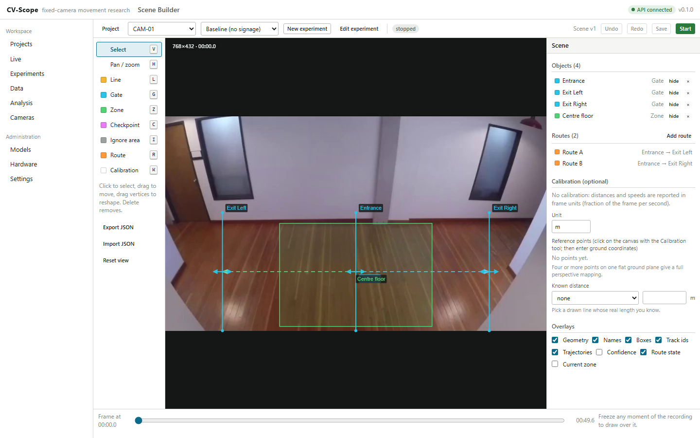
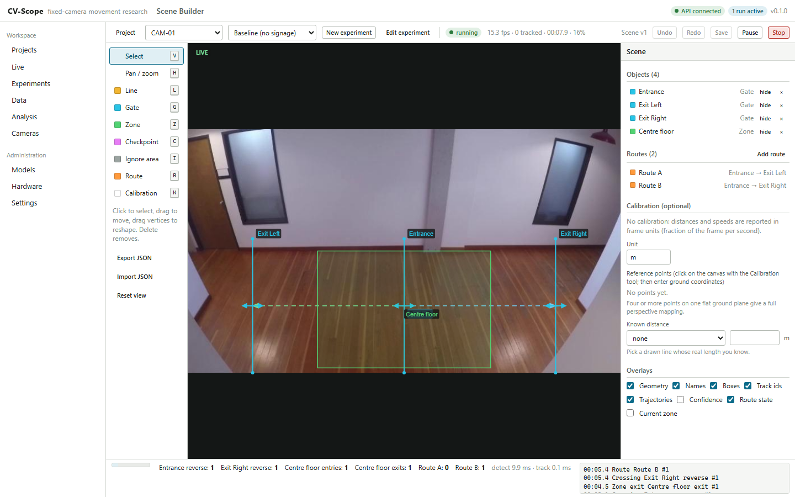
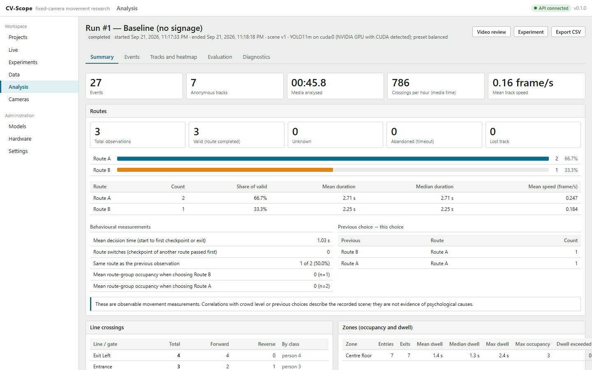
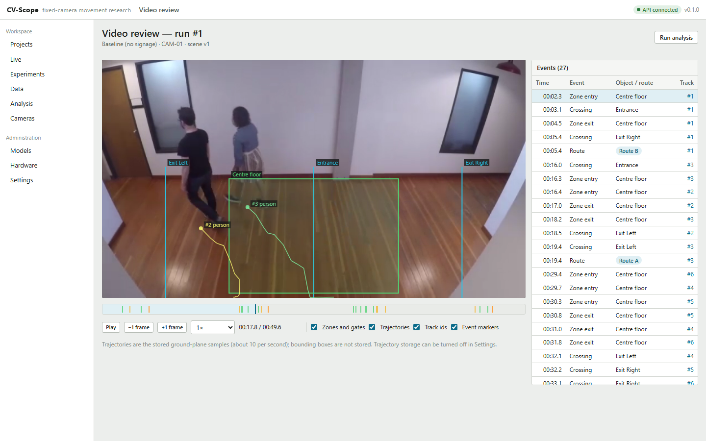
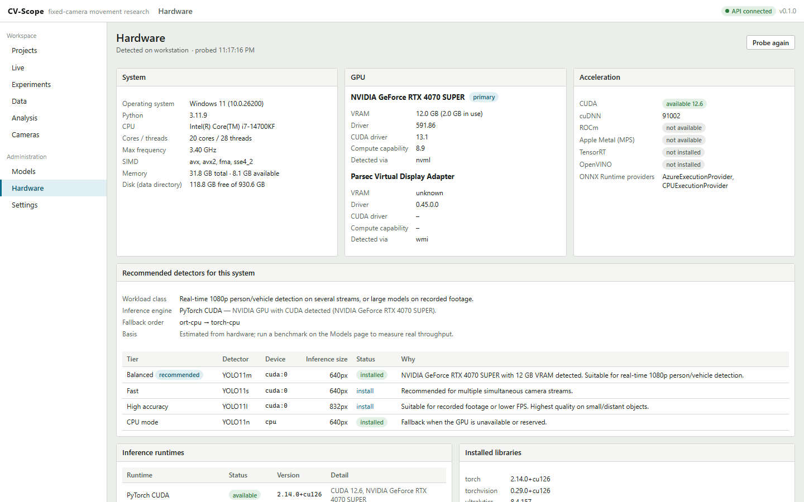
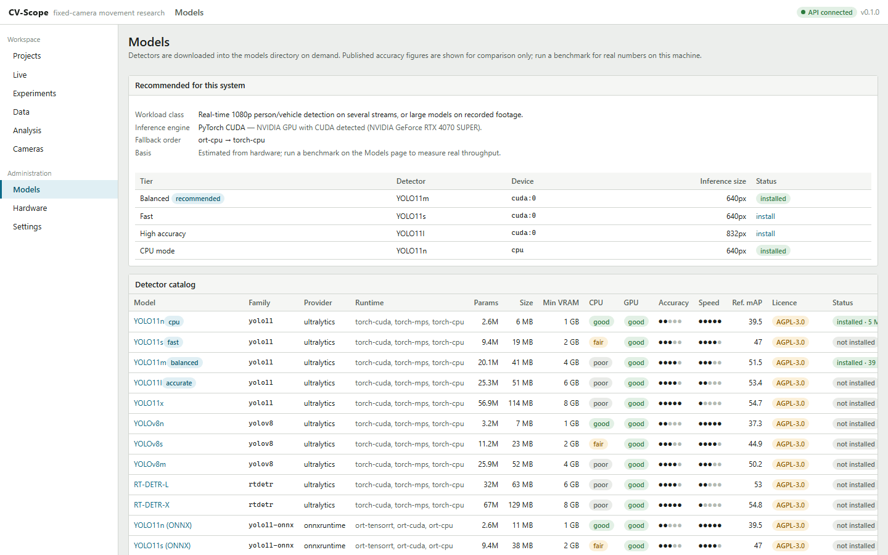

# CV-Scope

CV-Scope is an open-source computer-vision monitoring and research platform
for fixed cameras. Researchers, engineers, facility teams and students connect
a camera or a recorded video, draw lines, zones, checkpoints and routes
directly over the frame, choose which objects to track, and start an
experiment. The system tracks objects anonymously, turns their movement into
events (crossings, entries, exits, dwell, route choices) and stores research
data that can be analysed in the app or exported.

```text
Camera / Video -> Detection -> Multi-object tracking -> Spatial rules -> Events -> Stored data -> Analytics
```

The same platform serves pedestrian route-choice studies, retail and building
flow, queue and occupancy analysis, and road traffic counting with turn
analysis. No code is required to configure an experiment.

A one-page overview for sharing is in [BROCHURE.md](BROCHURE.md).

## What it does today

* **Hardware-aware setup.** On first launch CV-Scope inspects the CPU, RAM,
  GPU, VRAM, CUDA/ROCm/Metal availability, disk space and installed inference
  runtimes, and recommends detectors and inference settings for that machine.
  A local benchmark measures real preprocessing, detection and tracking times.
* **Model manager.** A catalog of maintained open-source detectors (YOLO11,
  YOLOv8, RT-DETR through Ultralytics; SSDLite and Faster R-CNN through
  torchvision; ONNX Runtime for exported models) with size, memory needs,
  CPU/GPU suitability, relative accuracy and speed, licence and install state.
* **Sources.** Uploaded or local video files, USB cameras, RTSP and HTTP
  streams with connection testing, rotation, crop and reconnect handling.
* **Scene Builder.** A canvas editor with select, pan, line, gate, zone,
  route, checkpoint, ignore-region and calibration tools; move, resize,
  vertex editing, rename, duplicate, enable/disable, lock, show/hide, undo and
  redo. Geometry is stored normalized to the source frame.
* **Rules.** Lines count and record crossings with direction; zones measure
  entries, exits, occupancy and dwell time; routes are logical paths through
  gates and checkpoints with outcomes ROUTE, UNKNOWN, ABANDONED and
  LOST_TRACK. A structured rule builder adds multi-step sequences and
  "remains for" dwell rules without code.
* **Experiments and runs.** Experiments pin a scene version, object classes,
  detector, tracker, preset and rules, carry research and condition notes,
  and can be duplicated to change one condition. Each run stores events,
  track summaries and (optionally) sampled trajectories.
* **Tracking.** ByteTrack by default, or BoT-SORT with camera-motion
  compensation and optional appearance matching for shaky cameras and
  crowded crossings. Track ids stay anonymous and session-scoped.
* **Live view.** Camera workers run in separate processes and stream previews,
  tracks, counters and events to the browser over a WebSocket, with debug
  overlays (ids, trails, confidence, route state, current zone).
* **Data and analysis.** A filterable event table with CSV, JSON and Parquet
  export; route distribution, crossings per line and direction, zone dwell
  and occupancy, class distribution, time series, trajectory heatmaps and
  experiment comparison.
* **Video review and evaluation.** Replay recorded runs with geometry and
  trajectory overlays and event markers; live cameras can record clips around
  events or the whole run (off by default) for the same review; mark events
  correct, incorrect,
  missed, wrong route, wrong class or tracking error, enter manual counts and
  get metrics computed only from those verdicts.
* **Privacy by default.** Anonymous session-scoped track ids, no face
  recognition or identity storage in the core, configurable trajectory and
  video retention, and a settings page that lists exactly what is stored.
* **Licensed recognition modules (optional, not open source).** Face
  recognition of deliberately enrolled identities and vehicle plate
  recognition, locked without a signed licence, with roles, audit, encrypted
  templates and retention. They plug into the same rule builder
  ("Recognized Person is Employee-017 ENTERS Server Room AND REMAINS FOR
  more than 5 minutes"). See `docs/recognition.md`.
* **Anomaly Assistant.** Learns the normal picture of a room, vault, stall or
  bed and reports meaningful change: objects that appear, disappear or move,
  presence where an area should be empty, a covered camera. Noise, shadows,
  small lighting changes and insects are filtered by computer vision. It
  keeps before and after pictures, and an optional vision language model
  (local, OpenAI, Claude, Gemini, OpenRouter, DeepSeek or any compatible API)
  describes or confirms each event. See `docs/anomaly.md`.
* **Relationships and correlated events.** A relationship engine turns what a
  camera observes into time-bounded, confidence-scored facts (approached,
  associated with, entered vehicle, parked in, crossed) and correlates them
  into higher-level events, each with the evidence behind it. Every link comes
  from a rule, a measurement or a sensor; a language model never creates one.
  See `docs/relationships.md`.
* **Locations and cross-camera journeys.** Cameras, sensors and places sit in
  a location tree with site plans and travel times. Sightings on different
  cameras become scored transitions and journeys, shown on an interactive,
  time-aware graph and a site view. See `docs/locations.md` and the worked
  multi-camera example in `docs/sample-scenario.md`.

## Screenshots

Captured from a real run on the corridor sample clip (`docs/screenshots/`).

| Scene Builder | Live run |
| --- | --- |
|  |  |

| Run analysis | Video review |
| --- | --- |
|  |  |

| Hardware | Models |
| --- | --- |
|  |  |

## Quick start

### Windows: download the installer

Download **[CV-Scope-Setup-Windows-x64.exe](https://github.com/ajm2004/CV-Scope/releases/latest/download/CV-Scope-Setup-Windows-x64.exe)**
from the [latest release](https://github.com/ajm2004/CV-Scope/releases/latest)
and run it. The setup wizard checks for an NVIDIA graphics card, lets you pick
the detection models and a data folder, and installs everything itself: a
private Python, PyTorch, the models and the sample videos. You need no
Python, Node or Git and no administrator rights. Afterwards start **CV-Scope**
from the Start menu: it starts the server and opens the app in your browser.
Requirements, updates and troubleshooting are in
[docs/install-windows.md](docs/install-windows.md).

### From source (Windows, Linux, macOS)

Requirements: Python 3.11+, Node 20+, and optionally an
NVIDIA GPU with a current driver. Everything runs on CPU as well.

```bash
git clone https://github.com/ajm2004/CV-Scope.git
cd CV-Scope
bash scripts/setup.sh            # Windows: powershell -ExecutionPolicy Bypass -File scripts\setup.ps1
bash scripts/dev.sh              # Windows: powershell -ExecutionPolicy Bypass -File scripts\dev.ps1
```

Open <http://localhost:5173>. The first-run wizard checks the system, shows the
detected hardware, recommends and downloads a detector, adds a camera or a
sample video, creates a project and opens the Scene Builder.

With Docker:

```bash
docker compose up                # CPU
docker compose --profile gpu up cvscope-gpu  # NVIDIA GPU (needs the NVIDIA Container Toolkit)
```

and open <http://localhost:8420>.

See `docs/installation.md` for CPU-only, NVIDIA and PostgreSQL setups,
`docs/user-guide.md` for the first experiment step by step, and
`docs/guides/` for 26 hands-on guides from easy to advanced.

## Command line

The setup scripts install the `cvscope` command into `.venv`
(`.venv/bin/cvscope`, on Windows `.venv\Scripts\cvscope`). With the virtual
environment active:

```bash
cvscope launch                     # start the server, open the browser, small window with Open/Stop (what the Windows shortcut runs)
cvscope serve                      # API and the built UI on http://127.0.0.1:8420 (build it once: cd frontend && npm run build)
cvscope migrate                    # apply database migrations
cvscope hardware                   # hardware discovery and detector recommendations
cvscope models list                # detector catalog and install state
cvscope models install yolo11n     # download a detector
cvscope benchmark yolo11n --video samples/videos/people-detection.mp4
cvscope anomaly analyse samples/videos/people-detection.mp4 --out anomalies/
cvscope recognition status         # licensed modules: status, licences, access tokens
cvscope --help                     # every command and option
```

`python -m pathscope` runs the same command line, and `pathscope` is kept as
an alias of `cvscope`.

## Sample data

`python scripts/download_samples.py` fetches two short CC-BY-4.0 clips from the
Intel IoT DevKit sample-videos repository. `samples/scenes/corridor_route_choice.json`
is a ready-made scene (entrance gate, two exit gates, one zone, two routes)
for the corridor clip. See `samples/README.md`.

## Repository layout

```text
backend/    FastAPI application, vision pipeline, engines, migrations, tests
frontend/   React + TypeScript application (Vite)
docs/       Architecture, installation, user guide, models, data model, privacy, developer guide
samples/    Sample scene and experiment configurations, sample video download
scripts/    Setup and development scripts
installer/  Windows installer (Inno Setup script, build and release tooling)
```

## Documentation

* `docs/architecture.md` — assessment, technology decisions, folder structure, domain model, hardware and inference strategy, Scene Builder design, phased plan
* `docs/install-windows.md` — the Windows installer: requirements, setup wizard, updates, uninstalling, silent installs
* `docs/installation.md` — CPU, NVIDIA GPU, Docker, PostgreSQL, configuration
* `docs/user-guide.md` — the first experiment, tools, rules, routes, analysis, export
* `docs/guides/` — 26 step-by-step guides, from a first count to a full study; also in the app under Help → Guides
* `docs/models.md` — supported detectors, runtimes, licences
* `docs/data-model.md` — tables and the event record
* `docs/privacy.md` — what is stored and how retention works
* `docs/anomaly.md` — the Anomaly Assistant and its vision-model providers
* `docs/relationships.md` — the relationship and event correlation engine
* `docs/locations.md` — locations, cross-camera correlation, the graph and site view
* `docs/sample-scenario.md` — a multi-camera walkthrough built from the public MEVA dataset
* `docs/recognition.md` — the licensed face and plate recognition modules
* `docs/developer.md` — code layout, engines, adding providers, testing
* `docs/maintainers.md` — repository protection, CI checks, reviewing pull requests

## Name

CV-Scope was developed under the working name PathScope. The Python package
(`pathscope`), the environment variables (`PATHSCOPE_*`) and the default
database file (`data/pathscope.db`) keep that name so that existing
installations and their data continue to work unchanged.

## Security and responsible use

CV-Scope has no login of its own and binds to `127.0.0.1` by default; read
`docs/guides/21-deploy-a-study.md` before opening it to a network. Camera
footage stays on the machine that runs it. Follow the privacy and signage
rules that apply where you record, and see `SECURITY.md` for reporting a
vulnerability.

## Status

Phases 1–7 of the plan in `docs/architecture.md` have a working first
implementation. Items that are not implemented are labelled as such in the UI
(for example native TensorRT engine export). Accuracy figures shown in the app are
either published upstream reference values, local benchmark measurements, or
metrics computed from manual verdicts; nothing is estimated as accuracy.

## Licence

CV-Scope is released under the Apache License 2.0 (see `LICENSE`).
Detector weights and optional packages keep their own licences; Ultralytics
models are AGPL-3.0. See `docs/models.md` before distributing a derived
product.
